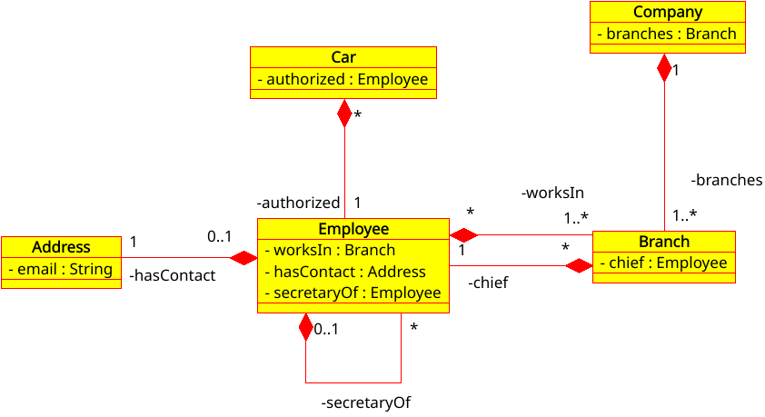

# XMI to JDL
Reads a Class Diagram XMI 1.2 file exported by 
[Umbrello UML Modeller](https://umbrello.kde.org/) 
and possibly other compatible products and produces
a [JHipster](https://www.jhipster.tech/jdl/) JDL output.

[](https://github.com/fillumina/xmi-to-jdl/actions/workflows/build.yml)



## Build and run

Needs a JDK 11 or later and Maven; the build itself targets Java 11.

```
mvn clean verify
```

That runs the tests and leaves two jars in `target`: the plain one and
a runnable shaded one that carries its dependencies.

```
java -jar target/xmi-to-jdl-2.1-shaded.jar diagram.xmi > diagram.jdl
```

Arguments:

1. `filename` - the XMI file to parse, required
2. `private` - `true` to skip private fields, `false` to keep them, 
default `false`

The JDL goes to the standard output, so redirect it to a file. Running 
with no arguments prints the usage.

## JHipster compatibility

Checked on 2026-09-27 against JHipster 9.4.0, by importing the JDL built 
from the test diagrams with JHipster's own importer.

The JHipster 6 and 7 ways of writing these are translated, so a model 
designed for them still produces an importable file:

 . a `{display}` marker is consumed and the display field is written 
inside the braces, `Address{email(email)}`; the trailing ` display` 
option JHipster 9 rejects is never written
 . `with jpaDerivedIdentifier` is dropped, the relationship is written as 
a plain one to one and the dropped option is reported in the `// ERRORS` 
section of the JDL
 . a relationship pointing at an entity JHipster provides, `User` or 
`Authority`, is marked `with builtInEntity`, as JHipster 9 requires

Every diagram in the tests is checked on every build. To run the same 
check with the real JHipster parser, install it once and point the test 
at it:

```
npm install generator-jhipster
mvn test -Djdl.parser.dir=../node_modules
```

Without that property the parser test is skipped and the rest still run.

## Versions

 . *2.0* 5/4/2020 uses class diagram relationships together with those defined 
in comments

 . *1.0* first version could define relationship types by comments only

The multiplicity are derived from the relationships defined in the class 
diagram itself or by using commands enclosed in curly brackets {} 
in the relationship comment. The two methods can be mixed.

If no relationship multiplicity is specified `ManyToOne` is used by default 
and the owner is the entity containing the actual field (the FK on the DB). 
The relation must be declared _only_ on the owner part. 

Only some of the options described here are parsed, the others will be
just copied in the final JDL, so it's future ready for new options 
to be added to JDL.

It can be instructed to honor the private visibility of fields
(by default it does not) so it can be used to translate into JDL a java code 
imported by Umbrello. 
This is a very useful workflow because it allows to test the model with POJOs 
and then translate it into a full blown application with JHipster.

It allows to inspect, test and modify the model before producing the
JDL file which is very useful in case of big and complex projects with many
entities and relationships.

*REMEMBER*: always set the code to 'Java' in Umbrello so that the data types are
set accordingly and you will not find a String entity when you use it
in one of your attributes (Umbrello defaults to C++).

## Entities

The following options (no parameters) can be added in curly braces in the
comment of any Entity (these are all parsed options).

 . `skipClient` doesn't build the client

 . `skipServer` doesn't build the server

 . `filter` adds advanced search filters to the server API

 . `pagination` or `infinite-scroll` pagination types


## Attributes
Attributes can be simple data types (such as String, LocalDate, Integer...)
accepted by JDL or relationships with other entities.

### Data Types

#### Option
Accepts the following options (no arguments):

 . `required`

 . `unique`

 . `display` it's the field to display when referenced
from another entity in a relationship 
(parsed option, there can be only one such field in an entity)

#### Validation
any validation valid for the field type:

 . String:  `minlength(2)`, `maxlength(33)`, `pattern(/[a-zA-z]{7}/)`

 . numbers: `min(1)`, `max(2000)`

 . blobs:  `minbytes(100)`, `maxbytes(2000)`


#### Multiplicity
One of:

 . `ManyToOne` (default if omitted)

 . `OneToMany`

 . `ManyToMany`

 . `OneToOne` eventually followed by <code>with jpaDerivedIdentifier</code>
(JHipster 6 and 7 syntax: JHipster 9 dropped it, so it is removed from
the JDL and reported in the `// ERRORS` section, see above)

eventually with `unidirectional` added to each of them;

## Constants

Constants are supported, just use the tag `{substitutions}` in the first
line of a note and put a substitution per line in there with the format:
```
KEY=VALUE
```
There are no quotes and the first `=` separates key and value.

These are some useful substitutions:

```
EMAIL_PATTERN=^[a-zA-Z0-9_.+-]+@[a-zA-Z0-9-]+\.[a-zA-Z0-9-.]+$

SIX_ALPHA=[a-zA-z]{7}
```

JDL supports number constants so MINLENGTH, MAXLENGTH and such can be 
used and initialized like that in the JH file (no support here, must be
added manually):
```
MINLENGTH = 20
```

## Test

The complete graph is available for testing to validate
it and can eventually be changed before producing the actual JDL.
This must be done programmatically by adding specific code. There is
a kind of pluggable way of doing this. Testing a graph is 
a very good way to avoid mistakes in case of complex projects with many
entities and relationships.

The test diagrams under `src/test/resources` are the ones the checks
above run on, so they are worth keeping valid.

## License

Apache License 2.0, see [LICENSE](LICENSE).
